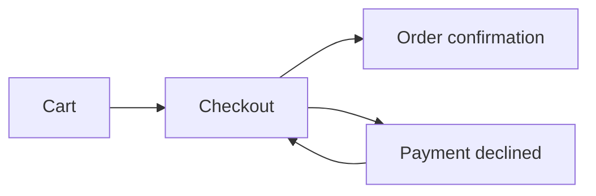

# figmaclaw

[](https://github.com/aviadr1/figmaclaw/actions/workflows/ci.yml?query=branch%3Amain)
[](https://github.com/aviadr1/figmaclaw/actions/workflows/codeql.yml?query=branch%3Amain)
[](https://app.codecov.io/gh/aviadr1/figmaclaw/tree/main)
[](https://pypi.org/project/figmaclaw/)
[](https://github.com/aviadr1/figmaclaw/blob/main/LICENSE)
[](https://docs.astral.sh/ruff/)
[](https://github.com/DetachHead/basedpyright)
[](https://pre-commit.com/)
[](https://docs.pytest.org/)
[](https://github.com/aviadr1/figmaclaw/security/dependabot)

**Your coding agent can't open Figma. figmaclaw mirrors your Figma files into your git repo as plain markdown (every page, section, frame and prototype flow) and keeps that mirror in sync from GitHub Actions.** Claude Code, Codex and plain `rg` can then read the design next to the code, instead of screenshots pasted into chat or slow, rate-limited API calls.


<sub>Recorded with [`docs/demo.tape`](https://github.com/aviadr1/figmaclaw/blob/main/docs/demo.tape). To run offline with no Figma token, [`docs/demo_fixture.py`](https://github.com/aviadr1/figmaclaw/blob/main/docs/demo_fixture.py) feeds a bundled page to figmaclaw's real pull code. On your own file, `figmaclaw track <file-key>` does that step.</sub>

## Install

```bash
uv tool install figmaclaw     # or: pipx install figmaclaw
figmaclaw --version
```

Needs Python 3.12+ on Linux or macOS (CI runs on Linux). On Windows, run it inside WSL: the CLI uses POSIX file locks and does not start natively.

To run the latest `main` instead: `uv tool install git+https://github.com/aviadr1/figmaclaw`.

## Quick Start

```bash
mkdir design-memory && cd design-memory && git init

figmaclaw init                   # writes 4 GitHub Actions workflows (sync, webhook, variables, webhook management)
export FIGMA_API_KEY=figd_...    # a Figma personal access token
figmaclaw track <file-key>       # key from figma.com/design/<file-key>/...; registers the file and pulls it
rg -n "Checkout" figma/          # the design is now files

git add . && git commit -m "Mirror Figma into git"
```

To keep the mirror fresh, push the repo to GitHub and add `FIGMA_API_KEY` as a repository secret. The installed sync workflow then runs every hour. Optional extras:

- `CLAUDE_CODE_OAUTH_TOKEN` secret: CI also writes the frame descriptions.
- `FIGMA_TEAM_ID` variable: new files in your team are tracked automatically.
- Figma webhooks: re-sync on every save (needs a small webhook proxy).

[docs/INSTALL.md](https://github.com/aviadr1/figmaclaw/blob/main/docs/INSTALL.md) covers all three. Then check the setup:

```bash
figmaclaw doctor              # install, API key, manifest, figma/ dir, workflows
figmaclaw workflows doctor    # are the installed workflows up to date with this figmaclaw?
```

## What You Get

One markdown file per Figma page, at `figma/<file>/pages/<page>.md`. This is the page from the demo, exactly as figmaclaw wrote it:

````markdown
---
enriched_schema_version: 0
file_key: demo01
flows: [['21:1', '21:2'], ['21:2', '21:3'], ['21:2', '22:1'], ['22:1', '21:2']]
frames: ['21:1', '21:2', '21:3', '22:1']
page_node_id: '12:40'
---

# Shop / Checkout

[Open in Figma](https://www.figma.com/design/demo01?node-id=12-40)

<!-- LLM: Write a 2-3 sentence page summary describing what this page covers -->

## Purchase (`20:1`)

<!-- LLM: Write a 1-sentence section intro if the section has a distinct theme -->

| Screen | Node ID | Description |
|--------|---------|-------------|
| Cart | `21:1` | (no description yet) |
| Checkout | `21:2` | (no description yet) |
| Order confirmation | `21:3` | (no description yet) |

## Errors (`20:2`)

<!-- LLM: Write a 1-sentence section intro if the section has a distinct theme -->

| Screen | Node ID | Description |
|--------|---------|-------------|
| Payment declined | `22:1` | (no description yet) |

## Screen Flow


````

- **Frontmatter** is machine state (node IDs, prototype flows, hashes). figmaclaw rewrites it on every sync.
- **The body** starts as a scaffold with `<!-- LLM: ... -->` placeholders. Fill it in by hand, or run `figmaclaw claude-run`, which launches Claude Code to screenshot the frames and write the descriptions. After the scaffold, code never rewrites the body, so that prose survives every re-sync.
- Node IDs are Figma's own, so any `rg` hit maps straight back to `figma.com/design/<file-key>?node-id=<id>`.

## Why figmaclaw

- **Files, not API calls.** Agents search `figma/**` with `rg` and read design history with `git log`, with no Figma round-trip per question.
- **Incremental sync.** A file whose Figma version hasn't changed is skipped outright. A page whose content hash hasn't changed is not rewritten. Per-frame hashes mark only the changed screens as stale, so screenshots and descriptions are redone only where the design moved.
- **Prose is never clobbered.** Sync touches frontmatter only. The body-preservation invariants are written down in [docs/body-preservation-invariants.md](https://github.com/aviadr1/figmaclaw/blob/main/docs/body-preservation-invariants.md) and enforced by tests.
- **Runs itself.** `figmaclaw init` installs thin caller workflows that call the reusable workflows in this repo. `figmaclaw workflows doctor|upgrade` detects and repairs drift after you upgrade figmaclaw.
- **Polite to the Figma API.** Requests are paced, and `429 Retry-After` responses are honored.

## For Design-System Migrations

Migrating a Figma file from one design system to another is where a one-shot agent pass *looks* right but produces silent corruption: inheritance leaks, frozen literals after an unbind, instances detached from their masters. Round 1 of a real-world migration produced 365 silently-incorrect bindings ([write-up](https://github.com/aviadr1/figmaclaw/blob/main/docs/migration-pipeline.md)).

The `audit-page` / `audit-pipeline` / `apply-tokens` commands turn those passes into checked pipelines. Every change is a manifest that is linted against accumulated rules (the `FCLAW` namespace), emitted as `use_figma` batches (`<prefix>-NNNN.{json,use_figma.js}` + `manifest.json`), and verified via REST. `apply-tokens` and `audit-page swap` share a `--dry-run` / `--emit-only` / `--execute` mode switch. The emitted scripts catch errors per row, so one bad row doesn't roll back the rows that succeeded, and the swap scripts never call `.detach()`.

| Command | Purpose |
|---|---|
| `audit-page emit-clone-script` | Clone a source page into an audit page (warns if the source looks inactive: archive, playground, prior audit clone, etc.). |
| `audit-page swap` | Apply component-instance swaps from a typed manifest, and persist the idMap so later `apply-tokens` runs target the new instances. |
| `audit-pipeline lint` | Validate `component_migration_map.v3.json` (nested and flat shapes). With `--variants <taxonomy.json>`, it also enforces variant-axis names, values, and coverage of the old axes. |
| `apply-tokens` | Apply variable-binding fixes. Accepts legacy compact rows and versioned manifests. Refusals list unrecognised and missing canonical fields, with a `did_you_mean_token_name` hint when a `<library>:` prefix is detected. |

See [docs/migration-pipeline.md](https://github.com/aviadr1/figmaclaw/blob/main/docs/migration-pipeline.md) for the full pipeline.

## How It Works

```text
Designer saves in Figma
  -> Figma webhook  -> figmaclaw apply-webhook   (re-syncs the changed file)
  -> hourly cron    -> figmaclaw pull            (re-syncs every tracked file)
       updates frontmatter; scaffolds new pages; skips unchanged files and pages
  -> figmaclaw claude-run (optional enrichment with Claude Code)
       inspect           : which pages and frames need descriptions?
       screenshots --stale: download only the changed frames
       write-body        : write the prose, keeping frontmatter intact
       mark-enriched     : record what was described
  -> git commit + push
```

## Common Commands

- `figmaclaw init`: install the GitHub Actions workflows into a repo.
- `figmaclaw track <file-key>`: register a Figma file and run its first pull.
- `figmaclaw list <team-id-or-url>`: discover files in a Figma team.
- `figmaclaw pull`: sync all tracked files.
- `figmaclaw sync <page.md>`: re-sync one page file.
- `figmaclaw diff`: show what designers changed between Figma versions (frames added, removed, renamed; flow changes).
- `figmaclaw inspect <page.md>`: report structure and enrichment state.
- `figmaclaw inspect-instance`: diff one INSTANCE against its master.
- `figmaclaw screenshots <page.md>`: download frame screenshots.
- `figmaclaw write-body` / `mark-enriched`: write prose, then record that enrichment is done.
- `figmaclaw census` / `variables`: snapshot published components and the design-system variable catalog.
- `figmaclaw workflows doctor|upgrade`: detect or repair workflow template drift.
- `figmaclaw self update` / `self skill`: upgrade figmaclaw, or print the bundled agent skill.

Run `figmaclaw --help` for the full list. Global options such as `--repo-dir PATH` and `--json` go before the command: `figmaclaw --repo-dir ../design-memory init`.

## Upgrade

Upgrade a PyPI install with `uv tool upgrade figmaclaw` (or `pipx upgrade figmaclaw`).

`figmaclaw self update` reinstalls from GitHub `main` (`uv tool install --force --reinstall --upgrade git+https://github.com/aviadr1/figmaclaw@main`), so use it only on a git install.

## Documentation

- Installation and CI setup: [docs/INSTALL.md](https://github.com/aviadr1/figmaclaw/blob/main/docs/INSTALL.md)
- Token auth and rotation: [docs/token-auth-and-rotation.md](https://github.com/aviadr1/figmaclaw/blob/main/docs/token-auth-and-rotation.md)
- Markdown schema: [docs/figmaclaw-md-format.md](https://github.com/aviadr1/figmaclaw/blob/main/docs/figmaclaw-md-format.md)
- Migration / lint / apply-tokens pipeline: [docs/migration-pipeline.md](https://github.com/aviadr1/figmaclaw/blob/main/docs/migration-pipeline.md)
- Body preservation design: [docs/body-preservation-design.md](https://github.com/aviadr1/figmaclaw/blob/main/docs/body-preservation-design.md)
- Body preservation invariants: [docs/body-preservation-invariants.md](https://github.com/aviadr1/figmaclaw/blob/main/docs/body-preservation-invariants.md)
- Failure postmortem and lessons: [docs/failure-postmortem-2026-04-03.md](https://github.com/aviadr1/figmaclaw/blob/main/docs/failure-postmortem-2026-04-03.md)

## Relationship To issueclaw

`figmaclaw` follows the same core architecture as [issueclaw](https://github.com/aviadr1/issueclaw) (webhook -> fetch -> render -> commit) but targets Figma. Consumer repos can use both (`figma/` + `linear/`) together.

## Development

```bash
git clone https://github.com/aviadr1/figmaclaw
cd figmaclaw
uv sync
uv run pre-commit install

uv run ruff format --check .
uv run ruff check .
uv run --group dev python -m basedpyright
uv run python -m pytest -q --cov=figmaclaw --cov-report=term-missing --cov-fail-under=70
```

To regenerate the demo GIF on Linux or macOS, install [VHS](https://github.com/charmbracelet/vhs) (with `ttyd` and `ffmpeg`), `rg` and the DejaVu Sans Mono font, then from the repo root:

```bash
uv sync
vhs docs/demo.tape    # writes docs/demo.gif
```

## Troubleshooting

- `ModuleNotFoundError: No module named 'fcntl'`: you are on native Windows. Run figmaclaw inside WSL.
- `FIGMA_API_KEY environment variable is not set.`: `track`, `pull` and `sync` need a Figma personal access token in `FIGMA_API_KEY`.
- `Claude credentials file not found` or `Could not find a Figma OAuth access token`: the MCP-based commands need `FIGMA_MCP_TOKEN`, or Figma authenticated inside Claude Code (`~/.claude/.credentials.json`).
- MCP servers without an `Mcp-Session-Id`: supported. `FigmaMcpClient` handles both sessionful and stateless MCP responses.
- `pre-commit` missing locally: run `uv run --with pre-commit python -m pre_commit install`.

## License

[MIT](https://github.com/aviadr1/figmaclaw/blob/main/LICENSE)
