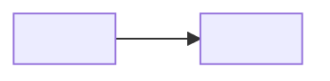

# figma-enrich-page

Enrich a figmaclaw `.md` file with:
- **Frame descriptions** — 1–3 sentence description for every frame
- **Page summary** — 2–3 sentence prose overview of the whole page
- **Mermaid flowchart** — screen-flow diagram derived from prototype reactions (only if flows exist)

## Expected output

A fully-enriched file looks like this:

```markdown
---
file_key: abc123
frames: {'node1': 'Description of frame 1.', 'node2': 'Description of frame 2.'}
flows: [['node1', 'node2']]
page_node_id: '1234:5678'
---

# File Name / Page Name

[Open in Figma](https://www.figma.com/design/abc123?node-id=1234-5678)

This page covers the onboarding flow across three steps: email entry, OTP verification,
and profile completion. Each section shows both the default and error states for each step.

## Section name (`section_node_id`)

| Screen | Node ID | Description |
|--------|---------|-------------|
| screen name | `node1` | Description of frame 1. |
| screen name | `node2` | Description of frame 2. |

## Screen flows

```mermaid
flowchart LR
    A["screen name"] -->|user taps CTA| B["next screen"]
` `` `
```

Key rules:
- Page summary goes **immediately after the `[Open in Figma]` link**, before the first `##` heading
- Mermaid block goes **at the very end** of the file under a `## Screen flows` heading
- If no `flows:` in frontmatter → omit `## Screen flows` entirely
- **Never** add a page summary or Mermaid block if one already exists — preserve existing prose

## Workflow (figmaclaw CLI available — e.g. CI)

### Step 1 — Re-sync structure from Figma

```bash
figmaclaw enrich <file_path>
```

This fetches the latest page structure from Figma, rebuilds the sections/frames table in the body,
and extracts prototype `reactions` into the `flows:` frontmatter field.
**Does NOT generate descriptions** — that's what the next steps are for.
Preserves existing frame descriptions.

### Step 2 — Check what's missing

```bash
figmaclaw page-tree <file_path> --json --missing-only
```

Exit code 1 = frames missing (normal at this point); 0 = all done, skip to Step 6.

### Step 3 — Download screenshots

```bash
figmaclaw screenshots <file_path> --pending
```

Downloads PNGs to `.figma-cache/screenshots/<file_key>/` for frames without descriptions.
Prints a JSON manifest: `{file_key, screenshots: [{node_id, path}]}`.

`--pending` skips frames that already have descriptions.

### Step 4 — Generate descriptions via subagents

Process frames in **batches of 8** using subagents so screenshots leave the main context after each batch.

For each batch, spawn a subagent:

> "Here are N Figma frames. Read each PNG with the Read tool:
> `<path_1>` (node_id: `<node_id_1>`), ...
>
> For each frame write a description of 1–3 sentences:
> - What the screen shows and its current state
> - Key UI elements visible (inputs, modals, CTAs, overlays, toggles, etc.)
> - What makes it visually distinct from its siblings
>
> Return only a JSON object: `{ "<node_id>": "<description>", ... }`"

While reading screenshots, also note the overall purpose and flow of the page — you'll need this for the page summary in Step 6.

### Step 5 — Write descriptions

Pipe JSON to stdin — **never use `--frames`** (descriptions may contain single quotes):

```bash
figmaclaw set-frames <file_path> << 'EOF'
{
  "node_id_1": "Description text, can contain 'single quotes' freely.",
  "node_id_2": "Another description."
}
EOF
```

`set-frames` merges descriptions into the frontmatter `frames:` dict. Existing descriptions are preserved.

### Step 6 — Write page summary and Mermaid flowchart

Read the current file. Then:

**Page summary** — if there is no prose paragraph between the `[Open in Figma]` link and the first `##` heading, add one:
- 2–3 sentences describing what the page covers overall
- What the key user flows or design decisions are
- What differentiates the main sections or frame groups
- Insert it immediately after the `[Open in Figma]` line (add a blank line before and after)

**Mermaid flowchart** — read the `flows:` frontmatter field:
- If `flows:` is present and non-empty, and there is no `## Screen flows` section yet, append to the end of the file:

```markdown
## Screen flows


` `` `

- Use frame names from the body tables (not raw node IDs) as node labels
- Infer transition labels from frame names and descriptions (e.g. "user taps Go Live", "OTP verified")
- If `flows:` is absent or empty → omit `## Screen flows` entirely

### Step 7 — Verify

```bash
figmaclaw page-tree <file_path> --json
```

Confirm `missing_descriptions` is 0.

### Step 8 — Commit and push

```bash
git add <file_path> .figma-sync/
git commit -m "sync: enrich <page-name> with frame descriptions"
git push || (git pull --no-rebase && git push)
```

## Fallback (figmaclaw not installed, MCP available)

### 1 — Read the existing .md for the frame inventory

Frontmatter contains `file_key` and `page_node_id`. Body tables list every frame with its node ID.

### 2 — Get screenshots via MCP in batches of 8

For each batch, spawn a subagent:

> "Here are 8 Figma frames from file `<file_key>`. Call `get_screenshot` for all 8 node IDs **in parallel**:
> `<node_id_1>`, ... `<node_id_8>`
>
> Return only a JSON object: `{ "<node_id>": "<1–3 sentence description>", ... }`"

### 3 — Write with set-frames via stdin

See Step 5 above — always use stdin heredoc, never `--frames`.

### 4 — Write page summary and Mermaid

See Step 6 above.

## Notes

- **Never parse the body prose** for node IDs, descriptions, or flows — always read frontmatter
- **Preserve existing prose** — if a page summary or section intro already exists, don't replace it
- The `reserach` section typo in some Figma files is real — preserve it as-is
- Small frames (≤200px) inside sections are usually icon/component details — still describe them, but note they are components
- If a section's table is empty after `figmaclaw enrich`, it means those frames had no node IDs in Figma — skip it
